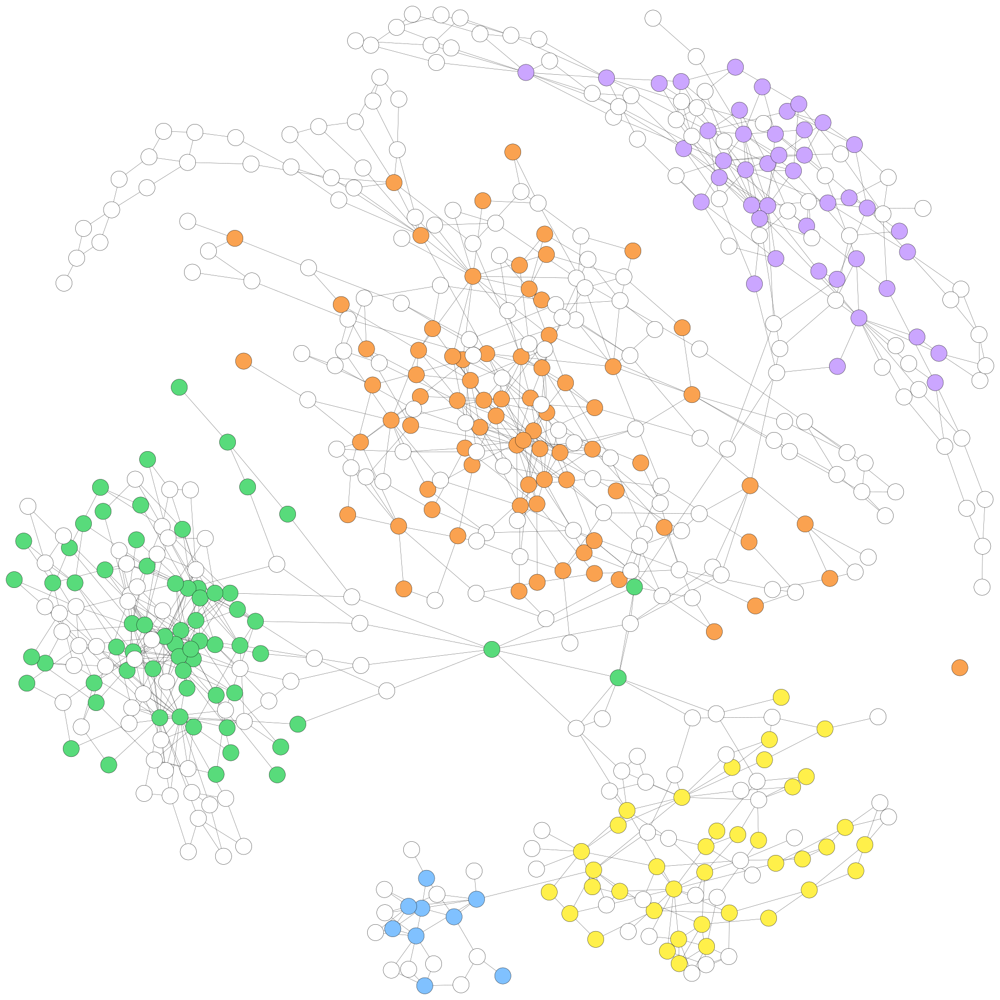
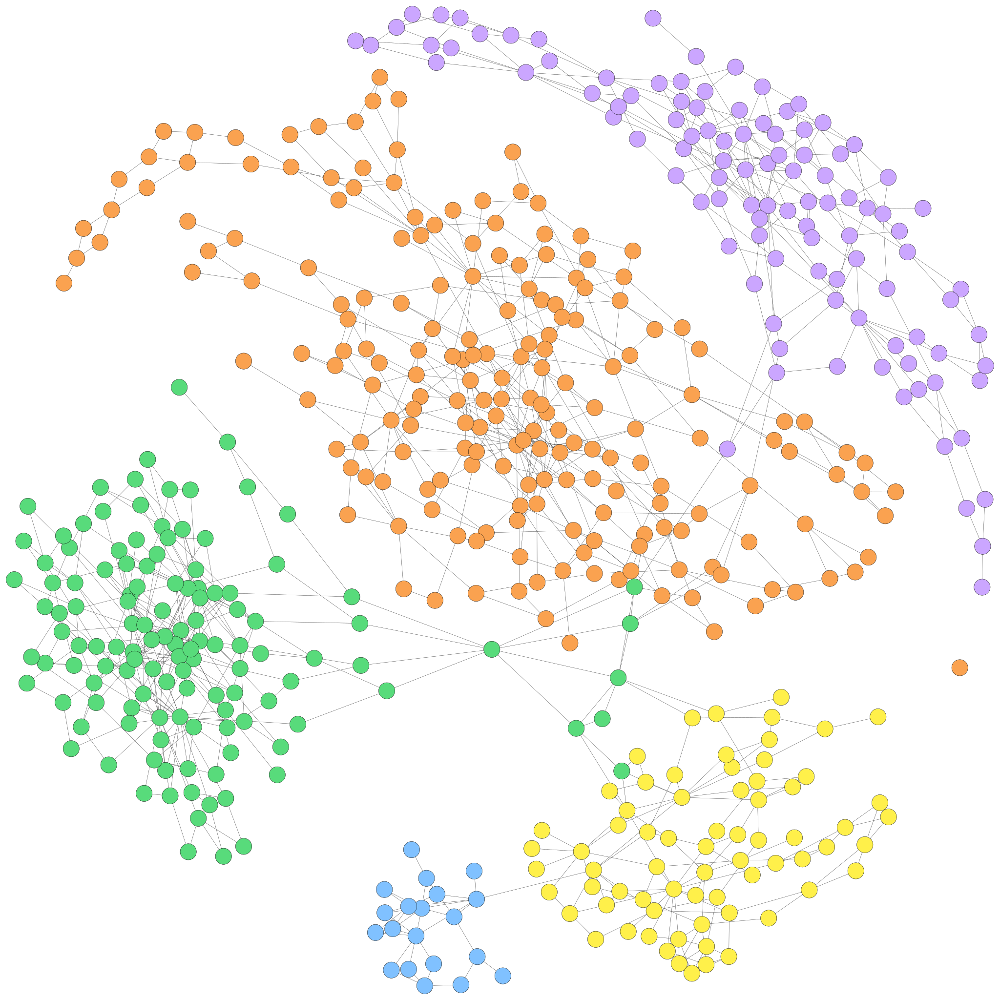
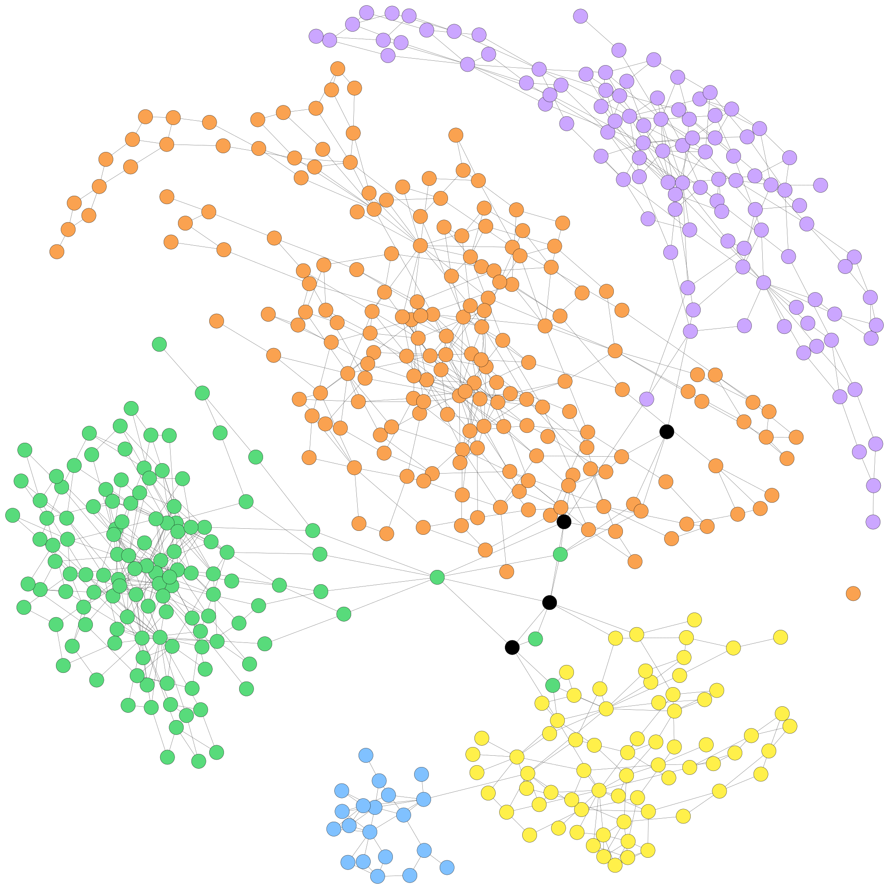

<p align="center">
  
</p>

# GraphBin2: Refined and Overlapped Binning of Metagenomic Contigs Using Assembly Graphs

[](https://doi.org/10.4230/LIPIcs.WABI.2020.8)
[](https://doi.org/10.1186/s13015-021-00185-6)
 


GraphBin2 is an extension of [GraphBin](https://github.com/Vini2/GraphBin) which refines the binning results obtained from existing tools and, more importantly, is able to assign contigs to multiple bins. GraphBin2 uses the connectivity and coverage information from assembly graphs to adjust existing binning results on contigs and to infer contigs shared by multiple species.

**Note:** Due to recent requests from the community, we have added support for long-read assemblies produced from Flye. Please note that GraphBin2 has not been tested extensively on long-read assemblies. We originally developed GraphBin2 for short-read assemblies. Long-read assemblies might have sparsely connected graphs which can make the label propagation process less effective and may not result in improvements.

## Getting Started

### Dependencies
GraphBin2 requires Python 3.7 (tested on Python 3.7.4). You will need the following python packages installed. Versions tested on are listed as well.
* [Biopython](https://biopython.org/) - version 1.74
* [python-igraph](https://igraph.org/python/) - version 0.7.1
* [tqdm](https://github.com/tqdm/tqdm) - version 4.36.1

### Downloading GraphBin2
You can download the latest release of GraphBin2 from [Releases](https://github.com/Vini2/GraphBin2/releases) or clone the GraphBin2 repository to your machine.

```
git clone https://github.com/Vini2/GraphBin2.git
```

If you have downloaded a release, you will have to extract the files using the following command.

```
unzip [file_name].zip
```

Now go in to the GraphBin2 folder using the command

```
cd GraphBin2/
```

### Setting up the environment
We recommend that you use [Conda](https://docs.conda.io/en/latest/) to run GraphBin2. You can download [Anaconda](https://www.anaconda.com/distribution/) or [Miniconda](https://docs.conda.io/en/latest/miniconda.html) which contains Conda.

Once you have installed Conda, make sure you are in the GraphBin2 folder. Now run the following commands to create a Conda environment and activate it to run GraphBin2.

```
conda env create -f environment.yml
conda activate graphbin2
```

Now you are ready to run GraphBin2.

If you want to switch back to your normal environment, run the following command.

```
conda deactivate
```


## Preprocessing

Firstly, you will have to assemble your set of reads into contigs. For this purpose, you can use metaSPAdes, SGA or metaFlye.

### metaSPAdes
[**SPAdes**](http://cab.spbu.ru/software/spades/) is a short-read assembler based on the de Bruijn graph approach. [**metaSPAdes**](https://genome.cshlp.org/content/27/5/824) is the dedicated metagenomic assembler of SPAdes. Use metaSPAdes (SPAdes in metagenomics mode) software to assemble short reads into contigs. A sample command is given below.

```
spades --meta -1 Reads_1.fastq -2 Reads_2.fastq -o /path/output_folder -t 16
```

### SGA
[**SGA**](https://github.com/jts/sga) (String Graph Assembler) is a short-read assembler based on the overlap-layout-consensus (more recently string graph) approach. Use SGA software to assemble short reads into contigs. Sample commands are given below. You may change the parameters to suit your datasets.

```
sga preprocess -o reads.fastq --pe-mode 1 Reads_1.fastq Reads_2.fastq
sga index -a ropebwt -t 16 --no-reverse reads.fastq
sga correct -k 41 --learn -t 16 -o reads.k41.fastq reads.fastq
sga index -a ropebwt -t 16 reads.k41.fastq
sga filter -x 2 -t 16 reads.k41.fastq
sga fm-merge -m 45 -t 16  reads.k41.filter.pass.fa
sga index -t 16 reads.k41.filter.pass.merged.fa
sga overlap -m 55 -t 16 reads.k41.filter.pass.merged.fa
sga assemble -m 95 reads.k41.filter.pass.merged.asqg.gz
```

### metaFlye
[**Flye**](https://github.com/fenderglass/Flye) is a long-read assembler based on the de Bruijn graph approach. [**metaFlye**](https://www.nature.com/articles/s41592-020-00971-x) is the dedicated metagenomic assembler of Flye. Use metaFlye (Flye in metagenomics mode) software to assemble long reads into contigs. A sample command is given below.

```
flye --meta --pacbio-raw reads.fasta --genome-size estimated_metagenome_size --out-dir /path/output_folder --threads 16
```

Next, you have to bin the resulting contigs using an existing contig-binning tool. We have used the following tools with their commands for the experiments.

#### [MaxBin2](https://sourceforge.net/projects/maxbin2/)

```
perl MaxBin-2.2.5/run_MaxBin.pl -contig contigs.fasta -abund abundance.abund -thread 8 -out /path/output_folder
```

#### [SolidBin](https://github.com/sufforest/SolidBin)

```
python scripts/gen_kmer.py /path/to/data/contig.fasta 1000 4 
sh gen_cov.sh 
python SolidBin.py --contig_file /path/to/contigs.fasta --composition_profiles /path/to/kmer_4.csv --coverage_profiles /path/to/cov_inputtableR.tsv --output /output/result.tsv --log /output/log.txt --use_sfs
```

## Using GraphBin2
You can see the usage options of GraphBin2 by typing `./graphbin2 -h` on the command line. For example,

```
usage: graphbin2 [-h] --assembler ASSEMBLER --graph GRAPH --contigs CONTIGS                 
                 [--paths PATHS] [--abundance ABUNDANCE] --binned BINNED                 
                 --output OUTPUT [--prefix PREFIX] [--depth DEPTH]
                 [--threshold THRESHOLD] [--delimiter DELIMITER]
                 [--nthreads NTHREADS]

GraphBin2 Help. GraphBin2 is a tool which refines the binning results obtained
from existing tools and, more importantly, is able to assign contigs to
multiple bins. GraphBin2 uses the connectivity and coverage information from
assembly graphs to adjust existing binning results on contigs and to infer
contigs shared by multiple species.

optional arguments:
  -h, --help            show this help message and exit
  --assembler ASSEMBLER
                        name of the assembler used (SPAdes, SGA or Flye)
  --graph GRAPH         path to the assembly graph file
  --contigs CONTIGS     path to the contigs file
  --paths PATHS         path to the contigs.paths file
  --abundance ABUNDANCE
                        path to the abundance file
  --binned BINNED       path to the .csv file with the initial binning output
                        from an existing tool
  --output OUTPUT       path to the output folder
  --prefix PREFIX       prefix for the output file
  --depth DEPTH         maximum depth for the breadth-first-search. [default:
                        5]
  --threshold THRESHOLD
                        threshold for determining inconsistent vertices.
                        [default: 1.5]
  --delimiter DELIMITER
                        delimiter for input/output results. Supports a comma
                        (,), a semicolon (;), a tab ($'\t'), a space (" ") and
                        a pipe (|) [default: , (comma)]
  --nthreads NTHREADS   number of threads to use. [default: 8]
```

## Input Format

The SPAdes version of `graphbin2.py` takes in 4 files as inputs (required).
* Contigs file (in `.fasta` format)
* Assembly graph file (in `.gfa` format)
* Paths of contigs (in `.paths` format)
* Binning output from an existing tool (in `.csv` format)

The SGA version of `graphbin2.py` takes in 4 files as inputs (required).
* Contigs file (in `.fasta` format)
* Abundance file (tab separated file with contig ID and coverage in each line)
* Assembly graph file (in `.asqg` format)
* Binning output from an existing tool (in `.csv` format)

The Flye version of `graphbin2.py` takes in 4 files as inputs (required).
* Contigs file (in `.fasta` format)
* Abundance file (tab separated file with contig ID and coverage in each line)
* Assembly graph file (in `.gfa` format)
* Binning output from an existing tool (in `.csv` format)

**Note:** The abundance file (e.g., `abundance.abund`) is a tab separated file with contig ID and the coverage for each contig in the assembly. metaSPAdes provides the coverage of each contig in the contig identifier of the final assembly. We can directly extract these values to create the abundance.abund file. However, no such information is provided for contigs produced by SGA. Hence, reads should be mapped back to the assembled contigs in order to determine the coverage of SGA contigs.

**Note:** Make sure that the initial binning result consists of contigs belonging to only one bin. GraphBin2 is designed to handle initial contigs which belong to only one bin.

**Note:** You can specify the delimiter for the initial binning result file and the final output file using the `delimiter` paramter. Enter the following values for different delimiters; `,` for a comma, `;` for a semicolon, `$'\t'` for a tab, `" "` for a space and `|` for a pipe.

**Note:** The binning output file should have delimiter separated (e.g., comma separated) values ```(contig_identifier, bin_number)``` for each contig. The contents of the binning output file should look similar to the example given below. Contigs are named according to their original identifier and the numbering of bins starts from 1.

Example metaSPAdes binned input
```
NODE_1_length_507141_cov_16.465306,1
NODE_2_length_487410_cov_94.354557,1
NODE_3_length_483145_cov_59.410818,1
NODE_4_length_468490_cov_20.967912,2
NODE_5_length_459607_cov_59.128379,2
...
```
Example SGA binned input
```
contig-0,1
contig-1,2
contig-2,1
contig-3,1
contig-4,2
...
```
Example Flye binned input
```
edge_1,1
edge_2,2
edge_3,1
edge_4,1
edge_5,2
...
```

You can use the [`prepResult.py`](https://github.com/Vini2/GraphBin2/blob/master/support/prepResult.py) script to format an initial binning result in to the .csv format with contig identifiers and bin ID. Further details can be found [here](https://github.com/Vini2/GraphBin2/blob/master/support/README.md#prepresultpy).

### Before using Flye assemblies for binning

Before using Flye assemblies for binning, please use the [`gfa2fasta.py`](https://github.com/Vini2/GraphBin2/blob/master/support/gfa2fasta.py) script to get the edge sequences. Further details can be found [here](https://github.com/Vini2/GraphBin2/blob/master/support/README.md#gfa2fastapy).

## Example Usage

```
python graphbin2.py --assembler spades --contigs /path/to/contigs.fasta --graph /path/to/graph_file.gfa --paths /path/to/paths_file.paths --binned /path/to/binning_result.csv --output /path/to/output_folder
```
```
python graphbin2.py --assembler sga --contigs /path/to/contigs.fa --abundance /path/to/abundance.tsv --graph /path/to/graph_file.asqg --binned /path/to/binning_result.csv --output /path/to/output_folder
```
```
python graphbin2.py --assembler flye --contigs /path/to/edges.fasta --abundance /path/to/abundance.tsv --graph /path/to/graph_file.gfa --binned /path/to/binning_result.csv --output /path/to/output_folder
```

## Visualization of the metaSPAdes Assembly Graph of the Sim-5G Dataset

### Initial Binning Result
<p align="center">
  
</p>

### Assembly Graph with Refined Labels
<p align="center">
  
</p>

### Assembly Graph after Label Propagation
<p align="center">
  
</p>

### Assembly Graph with Multi-labelled Vertices
<p align="center">
  
</p>

## References

[1] Barnum, T.P., _et al._: Genome-resolved metagenomics identifies genetic mobility, metabolic interactions, and unexpected diversity in perchlorate-reducing communities. The ISME Journal 12, 1568-1581 (2018)

[2] Mallawaarachchi, V., Wickramarachchi, A., Lin, Y.: GraphBin: Refined binning of metagenomic contigs using assembly graphs. Bioinformatics, btaa180 (2020)

[3] Nurk, S., _et al._: metaSPAdes: a new versatile metagenomic assembler. Genome Researcg 5, 824-834 (2017)

[4] Simpson, J. T. and Durbin, R.: Efficient de novo assembly of large genomes using compressed data structures. Genome Research, 22(3), 549–556 (2012).

[5] Wang, Z., _et al._:  SolidBin: improving metagenome binning withsemi-supervised normalized cut. Bioinformatics 35(21), 4229–4238 (2019).

[6] Wu, Y.W., _et al._: MaxBin: an automated binning method to recover individual genomes from metagenomes using an expectation-maximization algorithm. Microbiome 2(1), 26 (2014)

[7] Wu, Y.W., _et al._: MaxBin 2.0: an automated binning algorithm to recover genomes from multiple metagenomic datasets. Bioinformatics 32(4), 605–607 (2016)

## Citation
GraphBin2 has been accepted for publication at the 20th International Workshop on Algorithms in Bioinformatics ([WABI 2020](http://algo2020.di.unipi.it/WABI2020/)) and is published in [Leibniz International Proceedings in Informatics (LIPIcs)](https://www.dagstuhl.de/dagpub/978-3-95977-161-0) DOI: [10.4230/LIPIcs.WABI.2020.8](https://doi.org/10.4230/LIPIcs.WABI.2020.8). If you use GraphBin2 in your work, please cite the following publications.

```bibtex
@InProceedings{mallawaarachchi_et_al:LIPIcs:2020:12797,
  author =	{Vijini G. Mallawaarachchi and Anuradha S. Wickramarachchi and Yu Lin},
  title =	{{GraphBin2: Refined and Overlapped Binning of Metagenomic Contigs Using Assembly Graphs}},
  booktitle =	{20th International Workshop on Algorithms in Bioinformatics (WABI 2020)},
  pages =	{8:1--8:21},
  series =	{Leibniz International Proceedings in Informatics (LIPIcs)},
  ISBN =	{978-3-95977-161-0},
  ISSN =	{1868-8969},
  year =	{2020},
  volume =	{172},
  editor =	{Carl Kingsford and Nadia Pisanti},
  publisher =	{Schloss Dagstuhl--Leibniz-Zentrum f{\"u}r Informatik},
  address =	{Dagstuhl, Germany},
  URL =		{https://drops.dagstuhl.de/opus/volltexte/2020/12797},
  URN =		{urn:nbn:de:0030-drops-127974},
  doi =		{10.4230/LIPIcs.WABI.2020.8},
  annote =	{Keywords: Metagenomics binning, contigs, assembly graphs, overlapped binning}
}

@Article{Mallawaarachchi2021,
  author={Mallawaarachchi, Vijini G. and Wickramarachchi, Anuradha S. and Lin, Yu},
  title={Improving metagenomic binning results with overlapped bins using assembly graphs},
  journal={Algorithms for Molecular Biology},
  year={2021},
  month={May},
  day={04},
  volume={16},
  number={1},
  pages={3},
  abstract={Metagenomic sequencing allows us to study the structure, diversity and ecology in microbial communities without the necessity of obtaining pure cultures. In many metagenomics studies, the reads obtained from metagenomics sequencing are first assembled into longer contigs and these contigs are then binned into clusters of contigs where contigs in a cluster are expected to come from the same species. As different species may share common sequences in their genomes, one assembled contig may belong to multiple species. However, existing tools for binning contigs only support non-overlapped binning, i.e., each contig is assigned to at most one bin (species).},
  issn={1748-7188},
  doi={10.1186/s13015-021-00185-6},
  url={https://doi.org/10.1186/s13015-021-00185-6}
}
```
