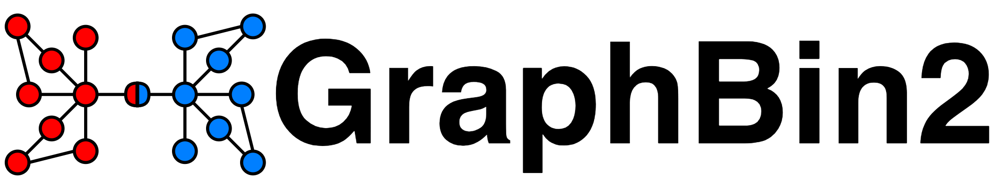

GraphBin2 is an extension of [GraphBin](https://github.com/Vini2/GraphBin) which refines the binning results obtained from existing tools and, more importantly, is able to assign contigs 
to multiple bins. GraphBin2 uses the connectivity and coverage information from assembly graphs to adjust existing binning results on contigs and to infer contigs shared by multiple 
species.

**Note:** Due to recent requests from the community, we have added support for long-read assemblies produced from Flye. Please note that GraphBin2 has not been tested extensively on long-read assemblies. We originally developed GraphBin2 for short-read assemblies. Long-read assemblies might have sparsely connected graphs which can make the label propagation process less effective and may not result in improvements.