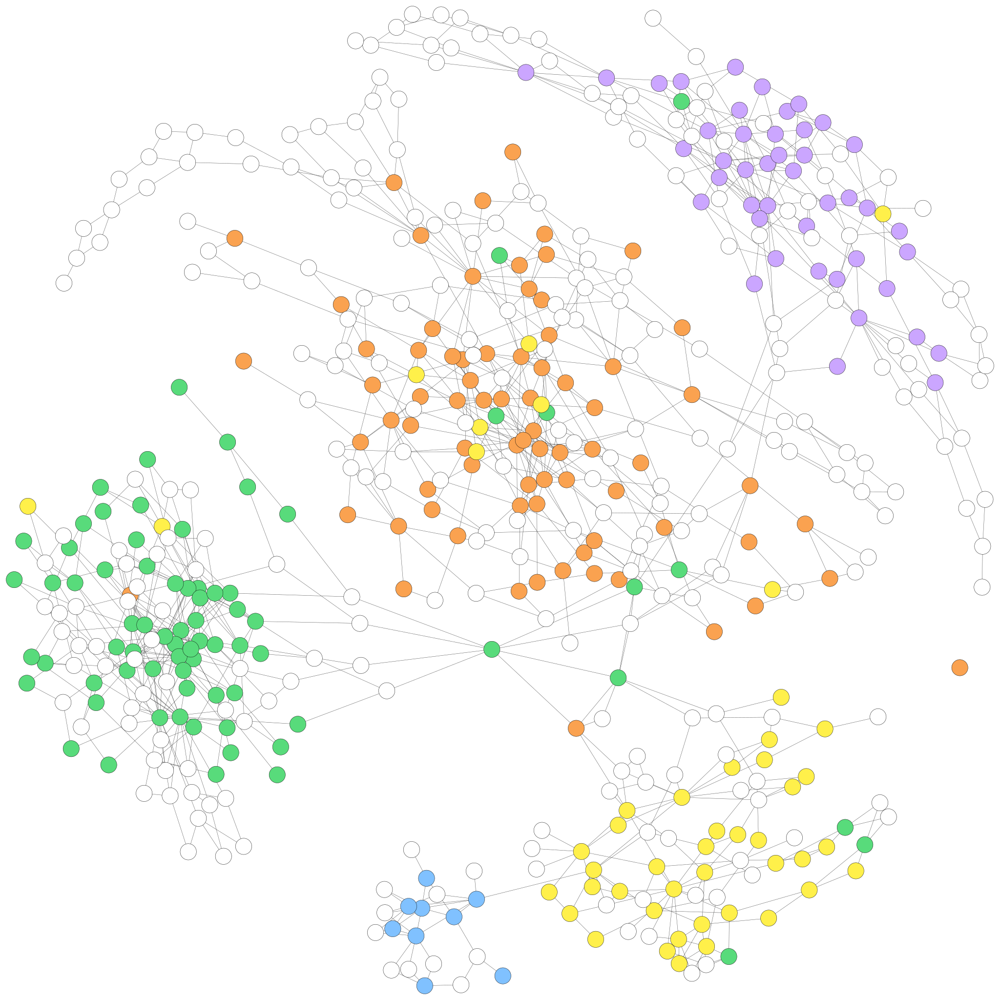

# Visualization of the metaSPAdes Assembly Graph of the Sim-5G Dataset

## Initial Binning Result

## Assembly Graph with Refined Labels

## Assembly Graph after Label Propagation

## Assembly Graph with Multi-labelled Vertices

