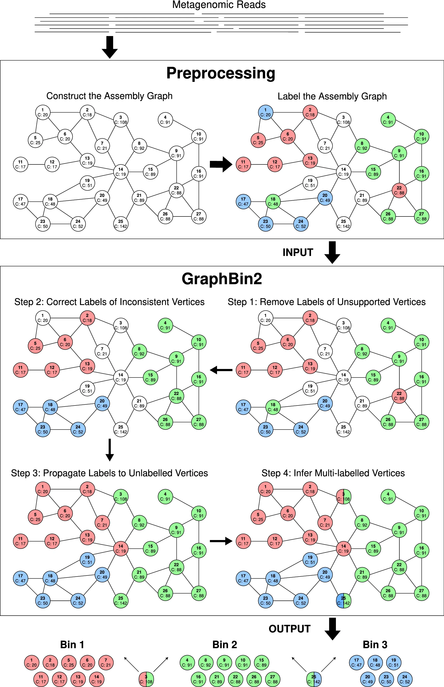

# Workflow

The overall workflow of GraphBin2 is shown below.

The preprocessing steps of GraphBin2 assemble reads into contigs using the assembly graph and then bin the contigs using existing contig-binning tools. GraphBin2 takes this labelled assembly graph as input, removes unsupported labels, corrects the labels of inconsistent vertices, propagates labels to unlabelled vertices and infers vertices with multiple labels. Finally, GraphBin2 outputs the bins with their corresponding contigs.